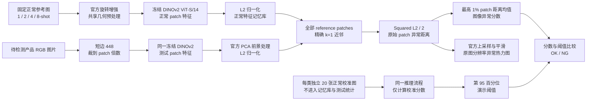

# Part 2 方法图

```mermaid
flowchart LR
    R["固定正常参考图<br/>1 / 2 / 4 / 8-shot"] --> A["官方旋转增强<br/>共享几何预处理"]
    A --> RF["冻结 DINOv2 ViT-S/14<br/>正常 patch 特征"]
    RF --> B["L2 归一化<br/>正常特征记忆库"]
    Q["待检测产品 RGB 图片"] --> P["短边 448<br/>裁到 patch 倍数"]
    P --> QF["同一冻结 DINOv2<br/>测试 patch 特征"]
    QF --> M["官方 PCA 前景处理<br/>L2 归一化"]
    B --> N["全部 reference patches<br/>精确 k=1 近邻"]
    M --> N
    N --> D["Squared L2 / 2<br/>原始 patch 异常距离"]
    D --> S["最高 1% patch 距离均值<br/>图像异常分数"]
    D --> H["官方上采样与平滑<br/>原图分辨率异常热力图"]
    C["每类独立 20 张正常校准图<br/>不进入记忆库与测试统计"] --> CP["同一推理流程<br/>仅计算校准分数"]
    CP --> T["第 95 百分位<br/>演示阈值"]
    S --> O["分数与阈值比较<br/>OK / NG"]
    T --> O
```

图像分数直接来自原始 patch 距离，**不是从彩色热力图读取**。阈值只影响演示判断，AUROC 使用阈值前连续分数。GPU 精确近邻是相同穷举距离计算的加速后端，数值核验与实际后端记录见 [GPU 实验说明](09_gpu_experiments.md)。
